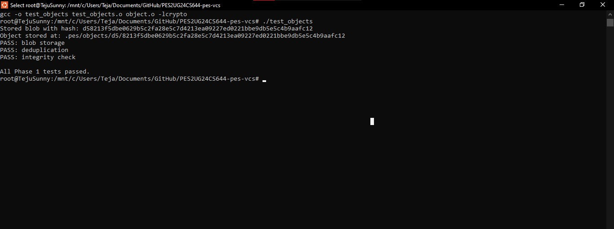
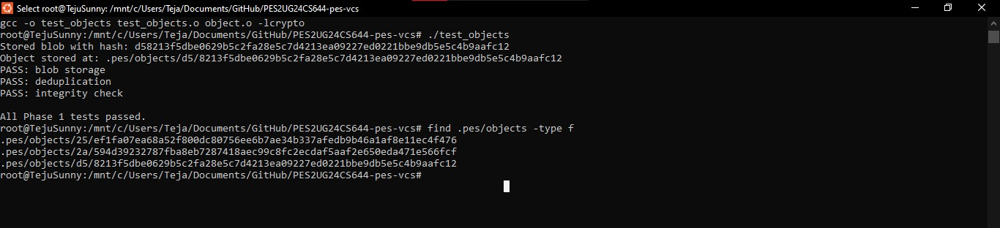
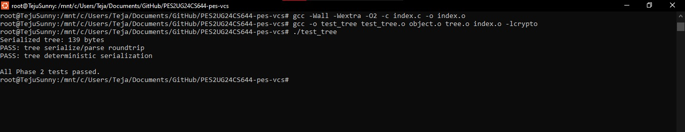
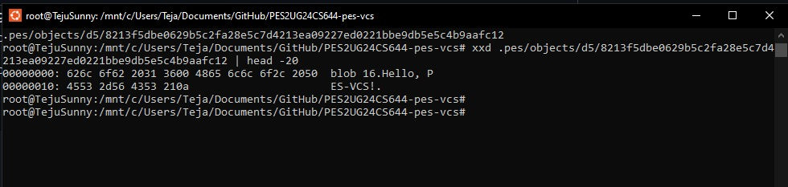
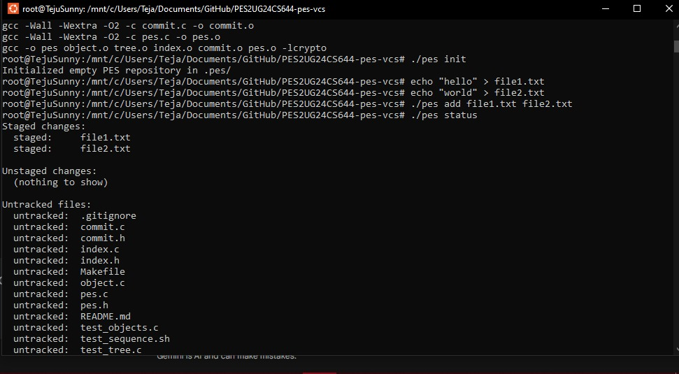
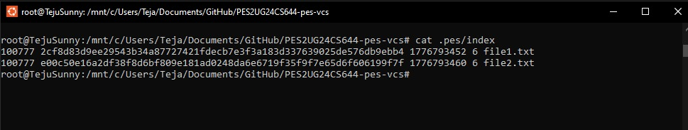
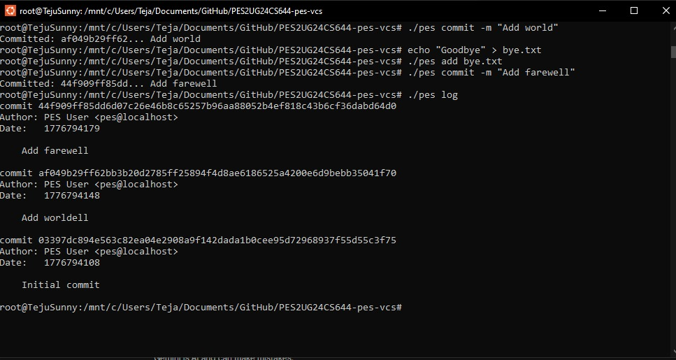
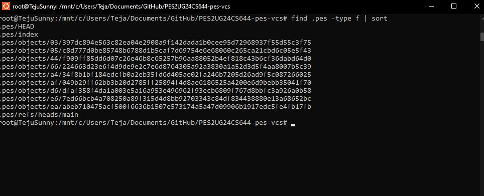
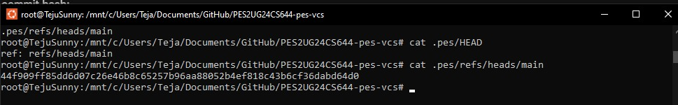

# PES-VCS Lab Report
**Author:** [Palla Tejeswar Reddy]
**SRN:** [PES2UG24CS644]

## Phase 1: Object Storage Foundation
**Screenshot 1A: Object Storage Tests Passing**

**Screenshot 1B: Sharded Directory Structure**

---

## Phase 2: Tree Objects
**Screenshot 2A: Tree Tests Passing**

**Screenshot 2B: Hex Dump of Raw Tree Object**

---

## Phase 3: The Index (Staging Area)
**Screenshot 3A: Staging Area Status**

**Screenshot 3B: Raw Text Index Format**

---

## Phase 4: Commits and History
**Screenshot 4A: Commit History Log**

**Screenshot 4B: Object Store Growth**

**Screenshot 4C: Reference Chain (HEAD and main)**

**Screenshot Final: Full Integration Test**

---

## Phase 5: Branching and Checkout (Analysis)

### Q5.1: Implementing Checkout
Implementing `pes checkout <branch>` requires updating two layers of the system:
1. **The Repository State:** The `.pes/HEAD` file must be updated to contain `ref: refs/heads/<branch>`, pointing the system to the new branch.
2. **The Working Directory:** The system must read the commit hash from the new branch, parse its root Tree object, and recursively traverse it. It must delete files in the working directory that do not exist in the new branch's tree, and extract/write blobs from the new tree into the working directory. Finally, it must update the `.pes/index` file to match this new state.
**Complexity:** The primary complexity lies in ensuring data safety—modifying the working directory without accidentally deleting user's unsaved, uncommitted work.

### Q5.2: Dirty Working Directory Conflict
To detect this conflict, the system must perform a three-way comparison:
1. Identify the modified file by comparing the working directory's metadata against the staged metadata in `.pes/index`. 
2. Parse the target branch's commit Tree to find the hash of that specific file in the destination branch.
3. If the file has unstaged changes in the working directory AND the hash of that file in the target branch is different from the hash in the current branch, the checkout must abort. Proceeding would overwrite the user's unsaved modifications with the target branch's version.

### Q5.3: Detached HEAD
A "Detached HEAD" occurs when the `HEAD` file contains a direct commit hash rather than a reference to a branch pointer. If you make commits in this state, the new commit objects are created and linked to their parents, and `HEAD` updates to the new hash, but *no branch file is updated*. 
If you subsequently switch to another branch, those new commits become "dangling" (unreachable by any human-readable name). A user can recover them by checking the repository's reflog (or memory) for the hash, and explicitly creating a new branch pointer at that hash (e.g., `git branch recovery-branch <hash>`).

---

## Phase 6: Garbage Collection and Space (Analysis)

### Q6.1: Garbage Collection Algorithm
To find and delete unreachable objects, the system must use a **Mark-and-Sweep algorithm**:
* **Mark Phase:** Start at all known "roots" (every file in `.pes/refs/heads/` and `.pes/HEAD`). Traverse the commit history backward via parent pointers. For every commit visited, recursively parse its Tree objects, extracting the hashes of all sub-trees and blobs. Add every discovered hash to a set. 
* **Sweep Phase:** Iterate through every physical file in the `.pes/objects/` directory. If a file's hash is not in the set of discovered hashes, it is unreachable and should be deleted.
* **Data Structure:** A **Hash Set** (or a Bloom Filter for memory efficiency) is ideal. By storing visited hashes in a set, the algorithm achieves $O(1)$ lookups, preventing infinite loops and redundant parsing of shared blobs across the 100,000 commits.

### Q6.2: GC Race Condition
Running garbage collection concurrently with a commit creates a critical race condition. If a user runs `pes add <file>`, a blob object is written to the object store. At this exact moment, the blob is *not* referenced by any commit or tree—it only exists in the index. If GC runs at this instant, the Mark-and-Sweep algorithm will flag this brand-new blob as unreachable and delete it. When the user subsequently runs `pes commit`, the system will attempt to build a tree referencing a blob that no longer exists, corrupting the repository.
**Git's Solution:** Git avoids this by implementing a **grace period** (typically 2 weeks). During the sweep phase, Git checks the filesystem timestamp of the unreferenced objects. It will only delete objects that are both unreachable *and* older than the grace period, ensuring freshly added files are never accidentally swept away.